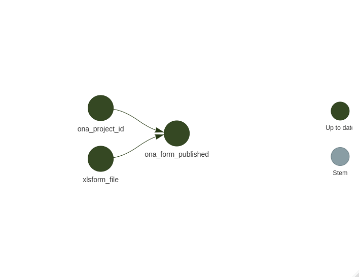

<!-- README.md is generated from README.Rmd. Please edit that file -->

# UNICEF Mozambique Open Data Kit Form for the Simple Spatial Survey Method (S3M) in Sofala Province

<!-- badges: start -->

<!-- badges: end -->

This repository contains the Simple Spatial Survey Method (S3M) survey
instrument in XLSForm and XForm standard for use in Open Data Kit
developed for UNICEF Mozambique.

This form (`sofala_s3m.xlsx` and `sofala_s3m.xml`) is for use in the
Sofala Province Simple Spatial Survey Method (S3M).

## Usage

For those wanting to test out the form on their own Android mobile
devices, the following applications need to be downloaded and installed
from the Google Play Store:

-   ODK Collect
    ([link](https://play.google.com/store/apps/details?id=org.odk.collect.android&hl=en_GB&gl=US))

-   ODK Counter
    ([link](https://play.google.com/store/apps/details?id=org.opendatakit.counter&hl=en_GB&gl=US))

Once these applications have been installed, there are two options for
getting the Sofala S3M form onto mobile devices.

1.  Using ODK Central or other similar ODK servers

The XLSForm found in the `forms` directory can be uploaded to a server
such as [ODK Central](https://docs.getodk.org/central-intro/),
[ONA](https://ona.io), [SurveyCTO](https://www.surveycto.com/),
[KoBoToolbox](https://www.kobotoolbox.org/) and the like. The form is
validated and then converted into XML format which can then be retrieved
from the server into mobile devices as a blank form.

2.  Transfer the XML version of the form to mobile devices via USB cable
    connection

The XML version of this form (available in the `forms` directory) can be
transferred to the mobile devices (into the device’s `odk` folder) via
local USB connection. This can be done by following the instructions
[here](https://docs.opendatakit.org/collect-forms/#loading-forms-directly).
Any associated media files for the forms will also need to be
transferred to the mobile device. This can be done by following the
instructions
[here](https://docs.opendatakit.org/collect-forms/#loading-form-media).

## Workflow for form deployment to ONA via R

This repository is also a
[`{targets}`](https://docs.ropensci.org/targets/)-based,
[`{renv}`]((https://rstudio.github.io/renv/articles/renv.html))-enabled,
and [Docker](https://www.docker.com/)-containerised workflow for
automated deployment of the form to [ONA](https://ona.io/) via [GitHub
Actions](https://github.com/features/actions).

This automation is useful during form development and testing.

## Author

[Ernest Guevarra](https://ernest.guevarra.io)

## License

This work is licensed under a [GNU General Public License 3
(GPL-3)](https://github.com/katilingban/mozambique-s3m-forms/blob/master/LICENSE.md)
